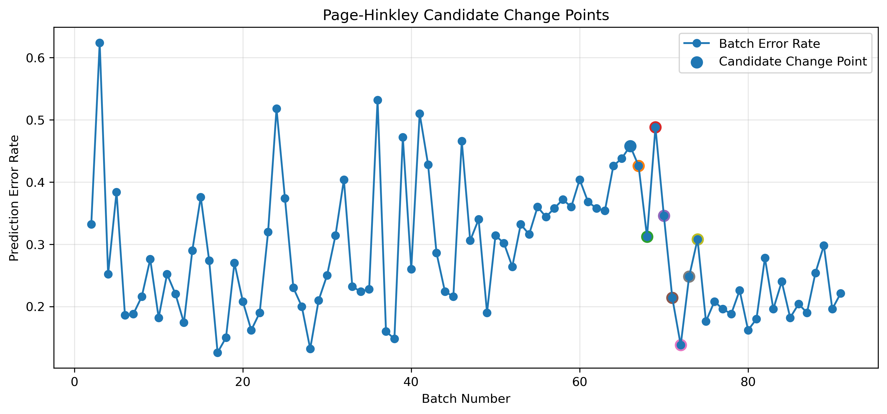
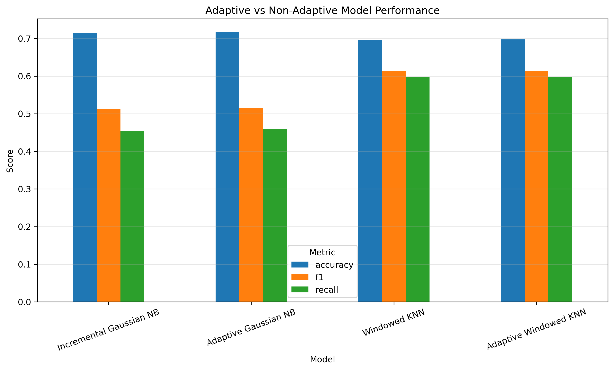
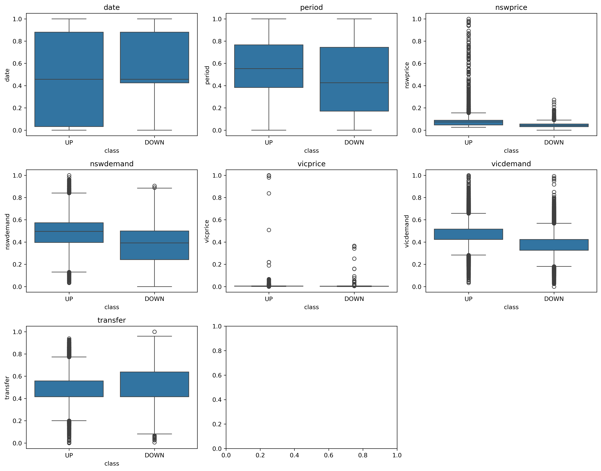
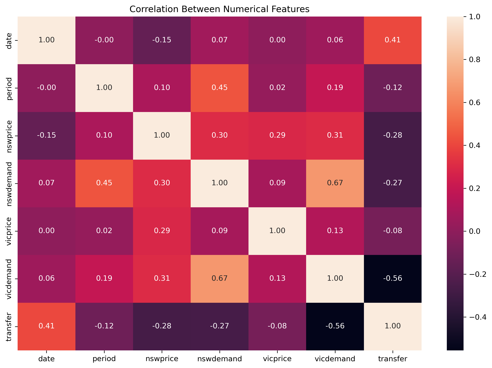

# DriftGuard: Adaptive Classification Under Concept Drift

<p align="center">
  <strong>Learn → Detect → Adapt</strong><br>
  <em>A streaming machine learning project that studies how classification models respond when data changes over time.</em>
</p>

<p align="center">


</p>

---

## Overview

A model can perform well when the data represented by its training history stays reasonably stable.

Streaming data is different. New observations keep arriving, older observations can become less useful, and the relationship between the input features and the target can change over time.

This is the problem I wanted to explore with **DriftGuard**.

Instead of training a classifier once and evaluating it on a fixed test set, I built a sequential learning workflow. The model receives data in batches, predicts new observations, monitors its prediction error, and can adapt when a candidate change is detected.

The project follows one simple idea:

```text
Learn → Detect → Adapt
```

I use two different model families to understand whether adaptation has the same effect on both:

- **Incremental Gaussian Naive Bayes**
- **Windowed K-Nearest Neighbors**

The goal is not just to find the highest-scoring model. I wanted to understand what happens when different models have different ways of remembering and forgetting historical information.

---

# Why I Built This

I wanted this project to go beyond a normal classification workflow.

A typical machine learning project often looks like:

```text
Dataset → Train → Test → Accuracy
```

For DriftGuard, I wanted to study a more realistic streaming setting:

```text
Data arrives
     ↓
Model learns
     ↓
Model predicts new data
     ↓
Prediction error is measured
     ↓
A change is monitored
     ↓
Model adapts if needed
     ↓
Model continues learning
```

This gave me the opportunity to work with:

- Streaming Machine Learning
- Incremental Learning
- Concept Drift
- Drift Detection
- Model Adaptation
- Prequential Evaluation
- Algorithm Implementation
- Testing
- Reusable Python code

---

# Architecture

```text
Electricity Data Stream
        ↓
Sequential Batches
        ↓
Predict Current Batch
        ↓
Evaluate Predictions
        ↓
Batch-level Error Rate
        ↓
Page-Hinkley Detection
        ↓
     ┌───────────────┐
     │               │
 No Candidate     Candidate
   Change           Change
     │               │
     ↓               ↓
 Continue         Adapt
 Learning           │
     │          ┌────┴────┐
     │          ↓         ↓
     │     Adaptive NB  Adaptive KNN
     │          │         │
     │          ↓         ↓
     └──────→ Model Update
                    ↓
                Next Batch
```

# Dataset

**Dataset:** Electricity / ELEC2  
**File:** `elecNormNew.arff`

The dataset contains electricity market observations with a target indicating whether the electricity price moves **UP** or **DOWN**.

## Dataset characteristics

| Property | Value |
|---|---:|
| Observations | **45,312** |
| Original columns | **9** |
| Predictors | **8** |
| Model-ready columns | **15** |
| Missing values | **0** |
| Duplicate rows | **0** |
| `DOWN` | **26,075 (57.54%)** |
| `UP` | **19,237 (42.46%)** |

## Preprocessing

I first validated the dataset before building any model.

The preprocessing decisions were:

- Numeric predictors were already normalized and were retained.
- `day` was treated as a categorical feature and one-hot encoded.
- `DOWN` was mapped to `0`.
- `UP` was mapped to `1`.
- `date` and `period` were retained at the modeling stage.
- The original sequential order was preserved.
- The complete dataset was not randomly shuffled.

After preprocessing:

```text
45,312 observations × 15 columns
```

The dataset does not provide explicit ground-truth concept-drift labels. Therefore, detector outputs are treated as **candidate change points**, not confirmed real-world drift events.

---

# Streaming Design

I divided the ordered observations into sequential batches of **500 observations**.

| Setting | Value |
|---|---:|
| Batch size | **500** |
| Total batches | **91** |
| Full batches | **90** |
| Final batch | **312 observations** |
| Warm-up | **Batch 1** |
| Evaluated batches | **90** |
| Evaluated observations | **44,812** |

The batch size is an experimental streaming configuration. It does not mean that the original dataset naturally arrives in batches of 500.

## Evaluation strategy

I use **prequential evaluation**.

In simple terms:

```text
Predict current batch
        ↓
Evaluate predictions
        ↓
Use current batch for learning
```

This means the model does not learn from the current batch before making predictions on it.

That keeps the evaluation free from current-batch label leakage.

---

# Models

## 1. Incremental Gaussian Naive Bayes

The first model is an incremental implementation of **Gaussian Naive Bayes**.

Instead of repeatedly recalculating statistics from the entire historical dataset, I maintain running statistics using **Welford's algorithm**.

Welford's algorithm allows the mean and variance to be updated one observation at a time.

This becomes the non-adaptive Gaussian NB baseline.

### Adaptive Gaussian NB

The adaptive version adds a forgetting mechanism.

When a candidate change is detected, older Gaussian statistics are given less influence through a decay operation.

The model then continues learning from incoming observations.

---

## 2. Windowed KNN

KNN works differently from Gaussian NB.

Instead of maintaining running statistical parameters, I keep a bounded collection of recent observations.

Initial configuration:

```text
Window size = 2,000 observations
n_neighbors = 5
```

The window keeps recent observations and removes older observations when the limit is reached.

### Adaptive Windowed KNN

When a candidate change is detected, the adaptive version reduces the current window to approximately half its size.

The idea is straightforward:

> If recent data appears to behave differently, allow the model to rely more heavily on the newest observations.

---

# Drift Detection

I implemented **Page-Hinkley** from first principles and tested it with controlled data.

## First approach: individual prediction errors

I initially applied Page-Hinkley directly to every binary prediction error.

This produced an excessive number of detections:

| Model | Detections |
|---|---:|
| Incremental NB | **39,523** |
| Windowed KNN | **40,833** |

This approach was rejected because the detector was too sensitive to individual prediction fluctuations.

## Final approach: batch-level error rate

I then aggregated prediction errors within each evaluated batch.

This produced a more interpretable error signal across the 90 evaluated batches.

```text
Minimum batch error rate: 0.126
Maximum batch error rate: 0.624
```

### Experimental Page-Hinkley settings

| Model | Delta | Threshold | Adaptation events |
|---|---:|---:|---:|
| Adaptive Gaussian NB | 0.01 | **1.5** | **1** |
| Adaptive Windowed KNN | 0.01 | **1.0** | **1** |

These are experimental settings selected from the observed error-signal behavior. They are not claimed to be globally optimal.

> Page-Hinkley detections are treated as **candidate change points**, not confirmed ground-truth drift events.

---

# Results

## Final Streaming Comparison

The final comparison uses the established **mean batch-level metrics**.

| Model | Accuracy | F1-score | Recall |
|---|---:|---:|---:|
| 🟦 Incremental Gaussian NB | **0.7141** | 0.5116 | 0.4533 |
| 🟩 **Adaptive Gaussian NB** | **0.7162 🏆** | 0.5161 | 0.4595 |
| 🟨 Windowed KNN | 0.6970 | **0.6133** | **0.5963** |
| 🟧 **Adaptive Windowed KNN** | 0.6972 | **0.6140 🏆** | **0.5970 🏆** |

### Best Model by Metric

| Metric | Best Model | Score |
|---|---|---:|
| 🏆 Accuracy | **Adaptive Gaussian NB** | **0.7162** |
| 🏆 F1-score | **Adaptive Windowed KNN** | **0.6140** |
| 🏆 Recall | **Adaptive Windowed KNN** | **0.5970** |

There is no single model that performs best across every metric.

---

## Main Result

The most important comparison in the project is between each model and its adaptive version.

| Model Family | Accuracy | F1-score | Recall |
|---|---:|---:|---:|
| Gaussian NB → Adaptive NB | 🟢 **+0.0021** | 🟢 **+0.0045** | 🟢 **+0.0062** |
| Windowed KNN → Adaptive KNN | 🟢 **+0.0002** | 🟢 **+0.0007** | 🟢 **+0.0007** |

The adaptive strategy improved both model families under the selected experimental configuration, but the improvement was more noticeable for Gaussian NB.

The reason is important: **Windowed KNN already forgets older observations through its bounded window**, while Gaussian NB keeps cumulative statistics and therefore has more to gain from explicit forgetting.

---

## 📊 Main Graph

The final model comparison is the main result of DriftGuard.


---

## 📈 Experiment Figures

### Baseline Model Comparison

This shows the initial model comparison before introducing the full adaptive workflow.


### Incremental Gaussian NB Streaming Performance

This shows how the incremental Gaussian NB model behaves across the sequential stream.


### Windowed KNN Streaming Performance

This shows the performance of the windowed KNN model across the sequential stream.


### Batch Error Rate

This is the error signal used for the final Page-Hinkley experiments.


### Page-Hinkley Candidate Change Points

The detected points are shown as **candidate change points**, not confirmed ground-truth drift events.



### Adaptive Model Comparison

This compares the adaptive and non-adaptive versions of the two model families.



### Feature Behaviour by Class

This figure was created during the initial dataset exploration to understand how the features behave across the target classes.



### Feature Correlation

This shows the relationships between the model features during the exploratory analysis.



---

## Results at a Glance

| 🧠 Model | 🎯 Accuracy | 📌 F1-score | 🔎 Recall |
|---|---:|---:|---:|
| Incremental Gaussian NB | 🟢 0.7141 | 🟡 0.5116 | 🟡 0.4533 |
| **Adaptive Gaussian NB** | 🟢 **0.7162** | 🟡 **0.5161** | 🟡 **0.4595** |
| Windowed KNN | 🟡 0.6970 | 🟢 0.6133 | 🟢 0.5963 |
| **Adaptive Windowed KNN** | 🟡 **0.6972** | 🟢 **0.6140** | 🟢 **0.5970** |

**Legend:** 🟢 stronger result within the comparison, 🟡 comparatively lower result. These colors are visual indicators only and do not represent statistical significance.

# Project Workflow

I built the project progressively, with each notebook answering a specific question.

```text
01  Dataset Validation & EDA
            ↓
02  Baseline Models
            ↓
03  Streaming Simulation
            ↓
04  Incremental Gaussian NB
            ↓
05  Windowed KNN
            ↓
06  Page-Hinkley Drift Detection
            ↓
07  Adaptive Models
            ↓
08  Final Evaluation
```

| Notebook | Purpose | Status |
|---|---|:---:|
| `01_dataset_validation_eda.ipynb` | Dataset validation and EDA | ✅ |
| `02_baseline_models.ipynb` | Chronological baseline models | ✅ |
| `03_streaming_simulation.ipynb` | Sequential stream simulation | ✅ |
| `04_incremental_naive_bayes.ipynb` | Incremental Gaussian NB | ✅ |
| `05_windowed_knn.ipynb` | Windowed KNN | ✅ |
| `06_page_hinkley_drift_detection.ipynb` | Page-Hinkley drift detection | ✅ |
| `07_adaptive_models.ipynb` | Adaptive models | ✅ |
| `08_final_evaluation.ipynb` | Final model evaluation | ✅ |

---

# Repository Structure

The repository is organized so that the notebooks explain the experiments, reusable logic lives in `src/`, tests stay in `tests/`, and meaningful outputs are stored under `reports/`.

```text
DriftGuard-Adaptive-Classification/
│
├── notebooks/
│   ├── 01_dataset_validation_eda.ipynb
│   ├── 02_baseline_models.ipynb
│   ├── 03_streaming_simulation.ipynb
│   ├── 04_incremental_naive_bayes.ipynb
│   ├── 05_windowed_knn.ipynb
│   ├── 06_page_hinkley_drift_detection.ipynb
│   ├── 07_adaptive_models.ipynb
│   └── 08_final_evaluation.ipynb
│
├── reports/
│   ├── figures/
│   └── results/
│
├── src/
│   └── driftaware/
│       ├── drift/
│       │   └── page_hinkley.py
│       └── models/
│           ├── adaptive_gaussian_nb.py
│           ├── adaptive_windowed_knn.py
│           ├── incremental_gaussian_nb.py
│           ├── running_stats.py
│           └── windowed_knn.py
│
├── tests/
│   ├── test_adaptive_gaussian_nb.py
│   ├── test_adaptive_windowed_knn.py
│   ├── test_incremental_gaussian_nb.py
│   ├── test_page_hinkley.py
│   ├── test_running_stats.py
│   └── test_windowed_knn.py
│
├── .gitignore
├── DRIFTGUARD_PROJECT_REPORT.md
├── pyproject.toml
├── requirements.txt
└── README.md
```

---

# Testing

Reusable components are covered with Pytest.

The test suite currently covers:

- `RunningGaussianStats`
- `IncrementalGaussianNB`
- `WindowedKNN`
- `PageHinkley`
- `AdaptiveGaussianNB`
- `AdaptiveWindowedKNN`

The tests check important behavior such as:

- incremental mean and variance calculations
- model updates and predictions
- bounded KNN window behavior
- drift detection on controlled signals
- adaptive decay behavior
- adaptive KNN window reduction

Run the complete test suite with:

```powershell
.\.venv\Scripts\python.exe -m pytest
```

---

# Engineering Decisions

I kept the implementation intentionally understandable.

### Why preserve sequential order?

Because the project studies streaming behavior. Randomly shuffling the complete dataset would remove an important part of the problem.

### Why use batch-level error instead of individual errors?

Individual prediction errors produced thousands of detections. Batch-level error rates provided a more useful signal for this experiment.

### Why Welford's algorithm?

It allows Gaussian statistics to be updated incrementally without recalculating statistics over the complete historical dataset.

### Why use a KNN window?

KNN needs stored observations for prediction. A bounded window keeps the model focused on recent data and prevents unlimited historical growth.

### Why compare adaptive and non-adaptive versions?

The main purpose is to understand the effect of adaptation itself rather than simply compare unrelated models.

### Why call them candidate change points?

The dataset does not contain ground-truth drift annotations, so detected points cannot honestly be presented as confirmed natural drift events.

---

# Project Principles

Throughout the project, I followed a few principles:

- Keep the data order intact.
- Avoid current-batch label leakage.
- Build the baseline before adding adaptation.
- Implement important algorithmic logic explicitly.
- Test reusable components.
- Keep adaptive and non-adaptive comparisons comparable.
- Save meaningful figures and experiment results.
- Avoid tuning only to improve the final numbers.
- Keep the code readable and understandable.
- Keep notebooks focused on explanation and experimentation.
- Be clear about what the experiments actually support.

---

# Limitations

This project is an experimental study, so the results should be interpreted within its scope.

### 1. No ground-truth drift labels

The dataset does not identify exact moments of concept drift.

### 2. Candidate change points

Page-Hinkley detections are candidate change points, not confirmed real-world drift events.

### 3. Experimental detector parameters

The detector thresholds were selected from observed error-signal behavior and were not optimized against known drift labels.

### 4. Single primary benchmark

The conclusions come from one non-stationary benchmark dataset. Additional datasets would provide stronger evidence.

### 5. KNN window size

The 2,000-observation window is an experimental baseline, not a proven optimum.

### 6. Modest adaptive improvements

The improvements are relatively small, especially for KNN.

### 7. Metric aggregation

The current final comparison uses mean batch-level metrics. A future publication-grade evaluation could additionally retain observation-level predictions and report global aggregate metrics.

---

# What I Learned

The biggest lesson from this project was that **adaptation is not automatically valuable just because data can drift**.

It depends on how much historical information the model already retains.

Gaussian NB accumulates statistical information over time. Giving older statistics less influence can therefore change its behavior more noticeably.

Windowed KNN already forgets older observations because its reference set is bounded. As a result, the additional adaptive step has much less impact.

So the most useful conclusion from DriftGuard is not simply that one model is better than another.

It is this:

> **A model's existing memory and forgetting behavior can determine how much additional adaptation is actually useful.**

---

# Future Improvements

The current project establishes the complete Learn → Detect → Adapt workflow.

Possible next steps include:

- Evaluate the approach on additional non-stationary datasets.
- Perform controlled KNN window-size sensitivity analysis.
- Compare additional drift detectors.
- Evaluate additional incremental classifiers.
- Report observation-level aggregate metrics alongside batch-level metrics.
- Strengthen the adaptive Gaussian statistics implementation for production use.
- Add experiment configuration files.
- Add automated experiment pipelines.
- Add continuous integration for automated testing.

---

# Tech Stack

### Languages and Tools

- Python
- Jupyter Notebook
- Git
- GitHub

### Data and Machine Learning

- NumPy
- Pandas
- SciPy
- Scikit-learn

### Visualization

- Matplotlib
- Seaborn

### Testing

- Pytest

### Concepts

- Streaming Machine Learning
- Incremental Learning
- Concept Drift
- Drift Detection
- Page-Hinkley
- Gaussian Naive Bayes
- K-Nearest Neighbors
- Prequential Evaluation
- Welford's Algorithm

---

# Author

## Pallavi Dahiya

I like building projects where I can understand what is happening at every stage, from the data and the assumptions behind it to the model, the experiments, and the final result.

My main interests are **Data Analytics and Machine Learning**, with a growing focus on writing practical and maintainable Python code. I enjoy working through problems step by step, testing ideas rather than assuming they work, and turning experiments into projects that are structured enough to be understood and reused.

With DriftGuard, I wanted to explore a problem that is easy to describe but much more interesting when implemented properly: what should a model do when the data it learns from starts changing?

That question took the project from basic data validation and baseline models to incremental learning, drift detection, adaptation, testing, and final evaluation.

I am interested in opportunities where I can continue learning while working on real data, analytical problems, and machine learning systems.

**GitHub:** [Pallavi415](https://github.com/Pallavi415)

---

<p align="center">
  <strong>DriftGuard</strong><br>
  <em>Learn from the stream. Detect change. Adapt to what comes next.</em>
</p>
